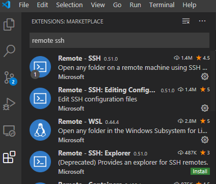
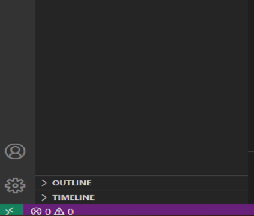
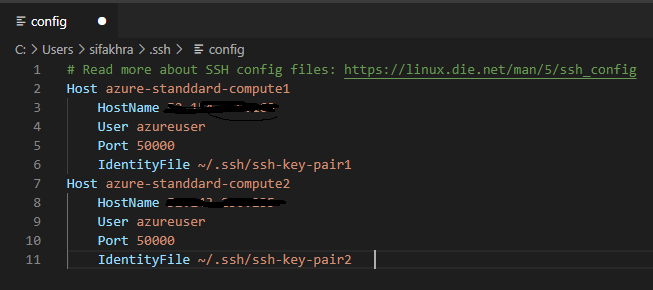
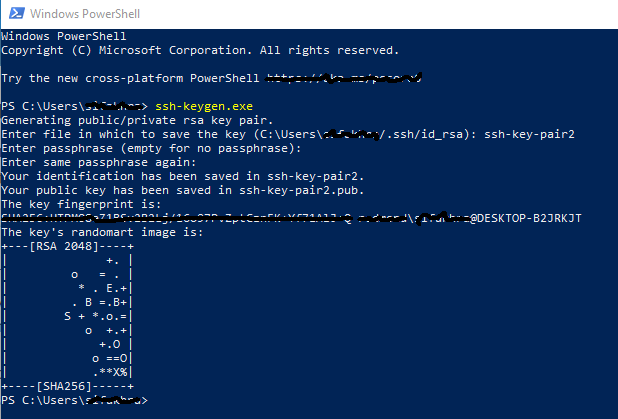
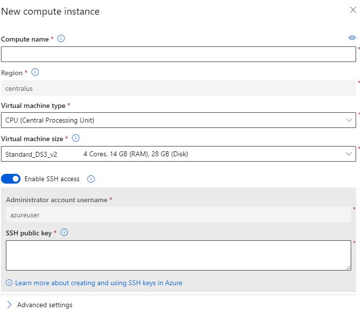
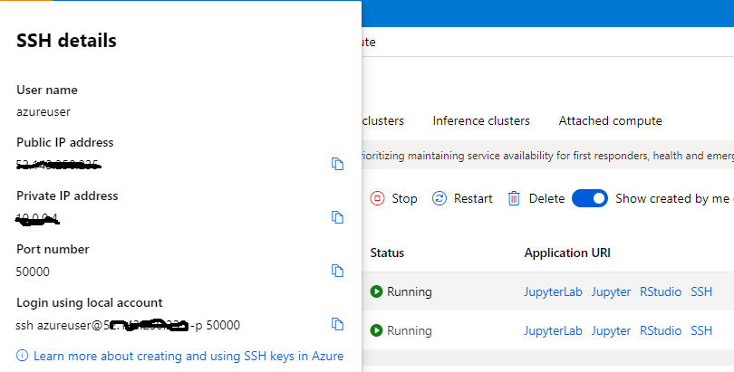

# Instructions on how to use VSC to develop remotely (e.g. on azure machine learning compute instace)

1. install Remote - SSH frrom the VC Extentions Marketplace  
 
2. click lower left hand corner of VC to connect  
 
3. select Remote-SSH: Connect to Host  
 
4. select Configure SSH Hosts...  
 
5. select local ssh config file (e.g. c\user\username\.ssh\config)   
 
6. update the config file  
 
7. generate ssh public/private key pair  
 
8. go to AML portal and create a ssh-enabled compute instance. make sure to copy and paste your generated public key into the SSH public key box  
 
9. get the SSH details (e.g. hostname, user, port) and update config file in step 6  
 
